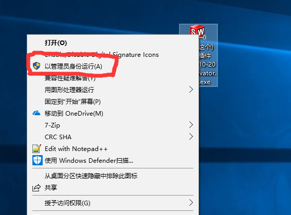
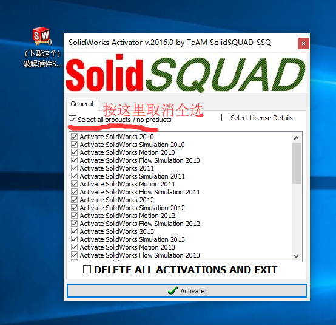
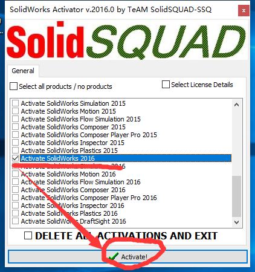
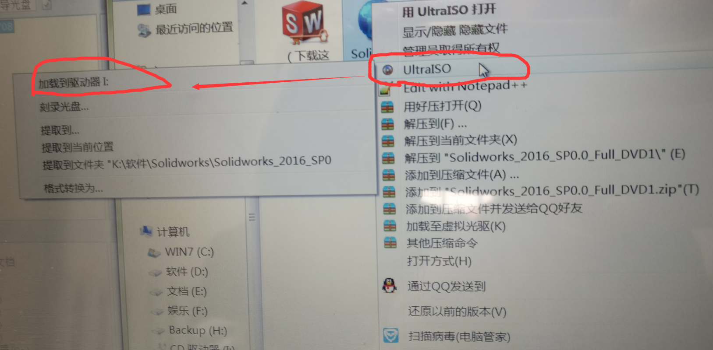
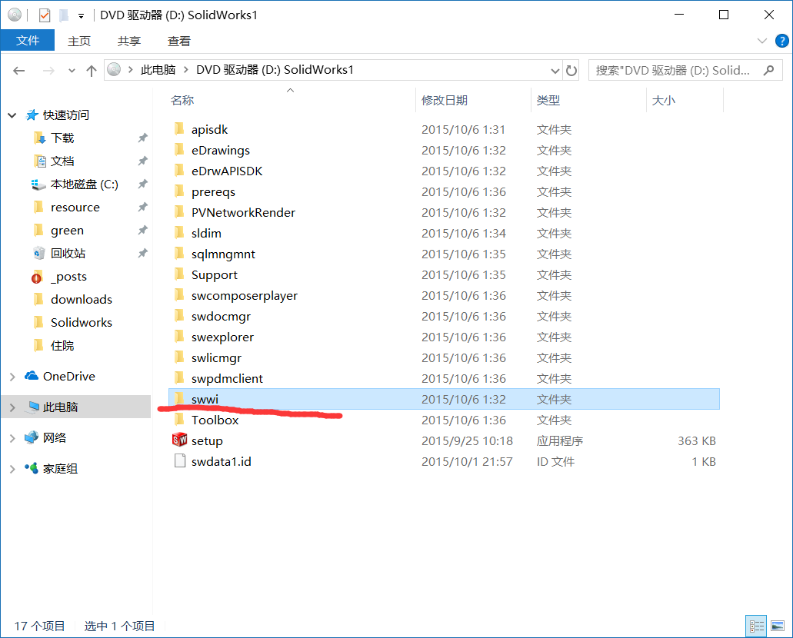
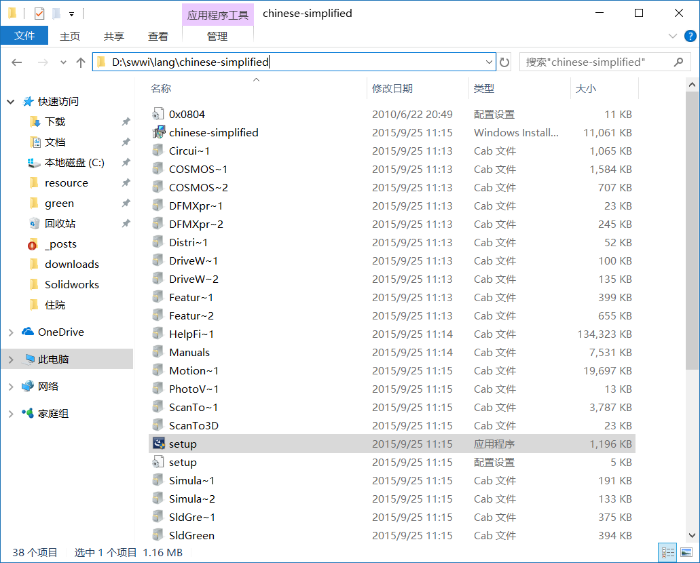

---

layout: post
title: "SolidWorks安装"

---

[安装包下载（微云分享）](https://share.weiyun.com/5ivuRyF)

（只能适用于64位的系统，32位系统需自行下载2014及之前的版本）

win7下载软碟通，win8以及win10使用资源管理器打开

软碟通的使用在下面

只打开第一个即可

断开网络

双击运行setup

序列号：

0001000107360361jk3qhdj3

此步选择取消

下一步下一步安装即可试用三十天

安装包里同样有破解软件，有大于三十天的试用需求可以用破解软件

右键，以管理员身份运行

把select all 取消勾选

往下翻找到SolidWorks 2016 勾选，点击绿色的对勾，等待激活完成（待补图）

另附1：软碟通的使用

[下载地址](https://cn.ultraiso.net/uiso9_cn.exe)

安装后在安装包右键

如图所示

另附2：安装时提示缺库

运行这个蓝色的setup即可